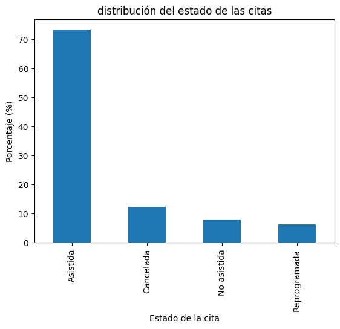
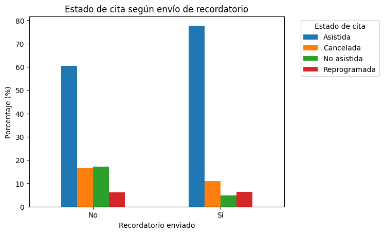
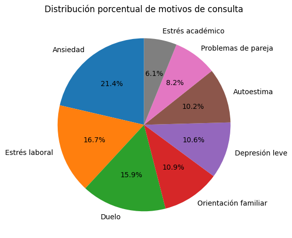
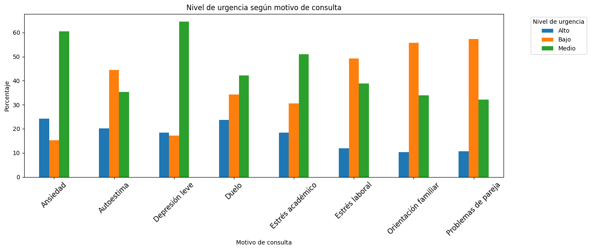
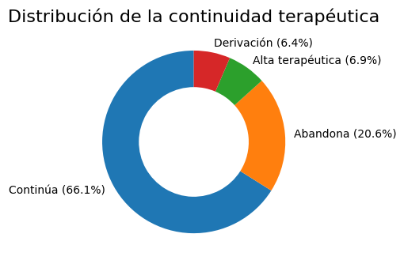
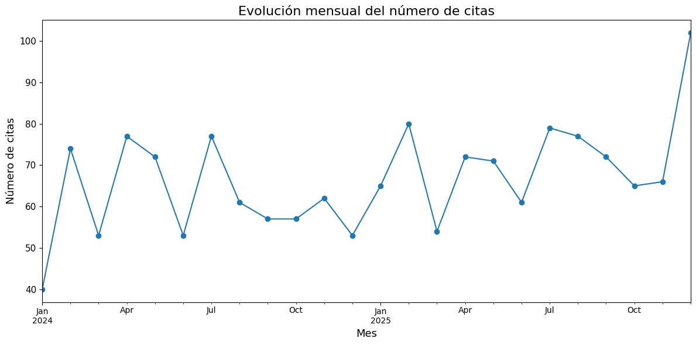

# CliniMind Analytics

## Análisis de citas y continuidad terapéutica en una clínica psicológica

CliniMind Analytics es un proyecto de análisis de datos aplicado a una clínica psicológica ficticia. El objetivo es unir **psicología**, **secretariado médico** y **data analytics** para estudiar la gestión de citas, la demanda psicológica y la continuidad terapéutica de los pacientes.

El dataset es sintético y fue creado con Python, por lo que no contiene datos reales ni información sensible de pacientes.

---

## Objetivo

Responder a la pregunta:

> ¿Cómo puede una clínica psicológica mejorar la gestión de sus citas, reducir ausencias y comprender mejor la demanda de sus pacientes mediante análisis de datos?

Se analizan variables como asistencia, cancelaciones, recordatorios, canales de reserva, modalidad online/presencial, motivos de consulta, nivel de urgencia, días de espera, satisfacción y continuidad terapéutica.

---

## Dataset

El dataset simula la actividad de una clínica psicológica durante dos años; 
- **1.600 citas**
- **400 pacientes ficticios generados**
- **392 pacientes únicos presentes en las citas**
- **Periodo:** enero 2024 - diciembre 2025
- **Datos sintéticos**
- **Sin valores nulos ni duplicados**

---

## Herramientas utilizadas

- Python
- Pandas
- NumPy
- Matplotlib
- Jupyter Notebook
- Git y GitHub

---

## Estructura del proyecto

```text
clinimind-analytics/
│
├── data/
│   ├── citas_clinica_prueba.csv
│   └── citas_clinica_completo.csv
│
├── images/
│   ├── estado_citas.png
│   ├── recordatorios_asistencia.png
│   ├── motivos_consulta.png
│   ├── motivo_urgencia.png
│   ├── continuidad_terapeutica.png
│   └── evolucion_mensual_citas.png
│
├── notebooks/
│   ├── 01_creacion_dataset.ipynb
│   └── 02_analisis_exploratorio.ipynb
│
└── README.md
```

---

## Fases del proyecto

### 1. Creación del dataset

En `01_creacion_dataset.ipynb` se genera un dataset sintético con variables administrativas y psicológicas.

Se aplican reglas para simular datos realistas, como mayor probabilidad de ansiedad o estrés académico en pacientes jóvenes, mayor presencia de estrés laboral en adultos y mayor frecuencia de duelo u orientación familiar en pacientes mayores.

### 2. Análisis exploratorio

En `02_analisis_exploratorio.ipynb` se analiza:

- estado de las citas,
- efecto de los recordatorios,
- motivos de consulta,
- nivel de urgencia,
- continuidad terapéutica,
- evolución temporal,
- canales de reserva,
- modalidad online/presencial,
- perfil de pacientes.

---

## Visualizaciones principales

### Estado de las citas



---

### Recordatorios y asistencia



---

### Motivos de consulta



---

### Motivos de consulta y nivel de urgencia



---

### Continuidad terapéutica



---

### Evolución mensual de citas



---

## Principales resultados

- El **73,25%** de las citas fueron asistidas.
- El **12,38%** fueron canceladas.
- El **8,06%** fueron no asistidas.
- Las citas con recordatorio tuvieron una asistencia del **77,72%**, frente al **60,48%** sin recordatorio.
- Los motivos de consulta más frecuentes fueron **ansiedad**, **estrés laboral** y **duelo**.
- El **66,06%** de los pacientes continúa el proceso terapéutico.
- El **20,62%** abandona.
- En 2025 se registraron más citas que en 2024.
- WhatsApp fue el canal de reserva más utilizado y con mejor tasa de asistencia.

---

## Recomendaciones

- Automatizar recordatorios de cita.
- Potenciar WhatsApp como canal de comunicación.
- Revisar mensualmente cancelaciones y no asistencias.
- Realizar seguimiento de pacientes con riesgo de abandono.
- Mantener la modalidad online y presencial.
- Usar el nivel de urgencia como apoyo para organizar primeras citas.
- Crear un dashboard de seguimiento interno.

---

## Limitaciones

Los datos son sintéticos, por lo que los resultados no representan evidencia clínica real. El objetivo del proyecto es educativo y de portfolio.


---

## Autora

Proyecto realizado por **Marta Lavín** como parte de su portfolio de análisis de datos, integrando psicología, secretariado médico y data analytics.
